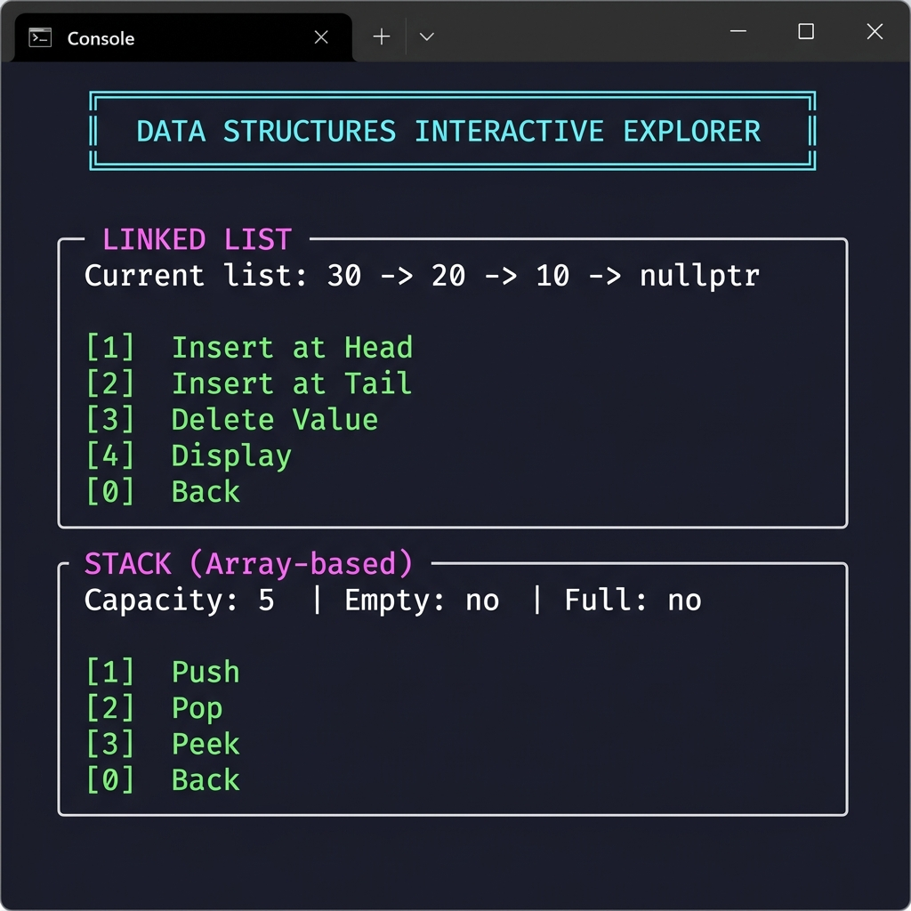

# 🗂️ Data Structures Interactive Explorer

> A C++ project demonstrating **5 classic data structures** through an interactive, colour-coded console application.


---

## 📸 Screenshots

### Main Menu


### Submenu — Linked List & Stack


---

## 📦 Data Structures Implemented

| # | Structure | File(s) | Complexity |
|---|-----------|---------|-----------|
| 1 | **Singly Linked List** | `LinkedList.h / .cpp` | Insert O(1) head, O(n) tail |
| 2 | **Stack (Array)** | `StackArr.h / .cpp` | Push / Pop / Peek O(1) |
| 3 | **Stack (Linked List)** | `StackLL.h / .cpp` | Push / Pop / Peek O(1) |
| 4 | **Circular Queue (Array)** | `QueueCirc.h / .cpp` | Enqueue / Dequeue O(1) |
| 5 | **Queue (Linked List)** | `QueueLL.h / .cpp` | Enqueue / Dequeue O(1) |

---

## 🗂️ Project Structure

```
DataStructureProject/
├── Node.h            # Shared Node struct (data + next pointer)
│
├── LinkedList.h      # Singly linked list interface
├── LinkedList.cpp    # insertAtHead, insertAtEnd, deleteValue, display
│
├── StackArr.h        # Array-based stack interface
├── StackArr.cpp      # push, pop, peek — overflow / underflow handled
│
├── StackLL.h         # Linked-list stack interface (StackLinkedList)
├── StackLL.cpp       # push, pop, peek — O(1), dynamic memory
│
├── QueueCirc.h       # Circular array queue interface (CircularQueue)
├── QueueCirc.cpp     # enqueue, dequeue — wrap-around with modulo
│
├── QueueLL.h         # Linked-list queue interface (QueueLinkedList)
├── QueueLL.cpp       # enqueue, dequeue — O(1) front/rear pointers
│
└── main.cpp          # Interactive console GUI — integrates all 5 structures
```

---

## 🔑 Key Design Decisions & Bug Fixes

### ✅ Include-Guard Conflicts Fixed
The original GitHub repository had **both `QueueCirc.h` and `QueueLL.h`** using the same guard `#ifndef QUEUE_H`, which caused one header to be silently ignored when both were included in `main.cpp`. Fixed with unique guards:

```cpp
// QueueCirc.h
#ifndef QUEUECIRC_H
#define QUEUECIRC_H
```
```cpp
// QueueLL.h
#ifndef QUEUELL_H
#define QUEUELL_H
```

### ✅ Class Name Consistency
`StackLL.cpp` used the class name `StackLL` while `StackLL.h` declared `StackLinkedList`. All references are now unified as `StackLinkedList`.

### ✅ Missing Destructor
`StackArr` was missing a destructor — added `delete[] arr` to prevent a memory leak.

---

## 🛠️ How to Build & Run

### Prerequisites
- **g++** (MinGW / GCC) or any C++17-compatible compiler
- Works on Windows, Linux, macOS

### Compile (single command)
```bash
g++ -std=c++17 -o DataStructures.exe \
    main.cpp LinkedList.cpp StackArr.cpp StackLL.cpp QueueCirc.cpp QueueLL.cpp
```

### Run
```bash
./DataStructures.exe    # Linux / macOS
DataStructures.exe      # Windows
```

---

## 🎮 Usage Guide

After running the executable you'll see the main menu:

```
  ╔══════════════════════════════════════════════════════╗
  ║        DATA STRUCTURES INTERACTIVE EXPLORER         ║
  ║   LinkedList · StackArr · StackLL · QCirc · QLL    ║
  ╚══════════════════════════════════════════════════════╝

  Choose a Data Structure:

  [1]  Linked List        (Singly-linked)
  [2]  Stack  (Array)     (Fixed capacity)
  [3]  Stack  (Linked List)(Dynamic, O(1))
  [4]  Queue  (Circular)  (Array-based)
  [5]  Queue  (Linked List)(Dynamic, O(1))
  [0]  Exit
```

Each sub-menu then lets you interact with the chosen structure:

| Operation | Linked List | Stack | Queue |
|-----------|------------|-------|-------|
| Insert/Push/Enqueue | ✔️ | ✔️ | ✔️ |
| Delete/Pop/Dequeue | ✔️ | ✔️ | ✔️ |
| Peek / Display | ✔️ | ✔️ | — |
| Overflow/Underflow guard | — | ✔️ | ✔️ |

---

## 📚 Data Structure Details

### 1. Singly Linked List
- `insertAtHead(v)` — prepend in O(1)
- `insertAtEnd(v)` — append in O(n), traverses to tail
- `deleteValue(v)` — removes first occurrence
- `display()` — prints `v1 -> v2 -> ... -> nullptr`

### 2. Stack (Array-based)
- Fixed capacity set at construction time
- `push` prints **"Stack Overflow"** when full
- `pop` / `peek` print **"Stack Underflow"** when empty
- Memory freed in destructor (`delete[] arr`)

### 3. Stack (Linked List)
- Dynamic size — no capacity limit
- Each push allocates a new `Node`; each pop deletes it
- O(1) for every operation

### 4. Circular Queue (Array-based)
- `front` and `rear` wrap around using `% capacity`
- `isFull()` checks two edge cases: `rear == capacity-1 && front == 0`, or `front == rear + 1`
- Gracefully prints **"Queue is full"** / **"Queue is empty"**

### 5. Queue (Linked List)
- Maintains `front` (oldest) and `rear` (newest) pointers
- Enqueue to rear O(1), dequeue from front O(1)
- `isFull()` always returns `false` — unbounded

---


---
